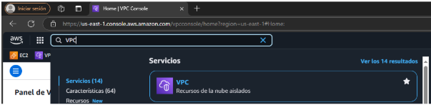
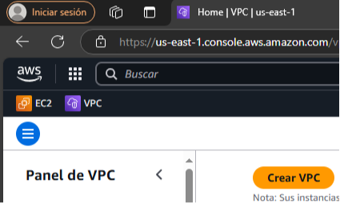
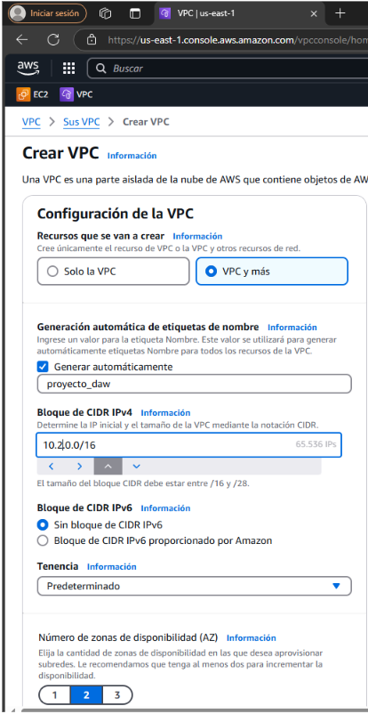
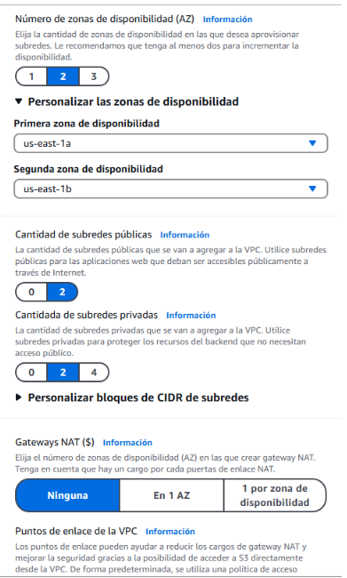
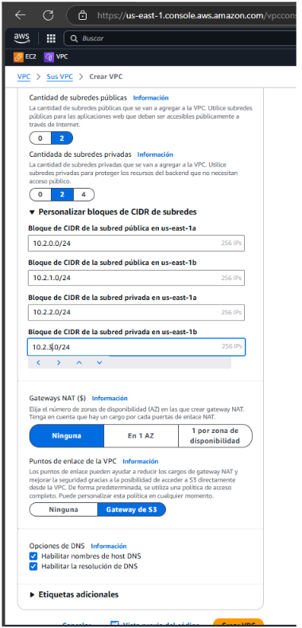
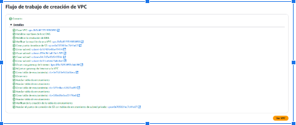

# Instalación de Wordpress en instancia Debian(o Ubuntu) EC2 con soporte de base de datos RDS y EFS

La idea de este manual es configurar un servidor web apache montado en una instancia EC2 Debian (o Ubuntu) con un sistema de almacenamiento en EFS y la base de datos que esté gestionada por RDS en una subred privada.

Para ello necesitaremos primeramente un VPC que tenga dos subredes públicas y dos privadas.
El objeto de crear dos subredes públicas es construir al final del ejercicio un balanceador de carga que permita servir contenidos en función de la carga de los servidores.

## Paso 1 Creación de las VPCs

Primero, debemos diseñar la estructura de nuestra red, incluyendo las distintas instancias y los servicios EFS y RDS. Nuestra VPC estará compuesta por cuatro subredes: dos públicas y dos privadas. Para crearlas, accedemos a nuestro laboratorio de AWS, buscamos "VPC" en el buscador y seleccionamos la opción correspondiente.

Una vez que estemos dentro de la sección de VPC le daremos al boton de "Crear VPC"

En la parte de Crear VPC, Ponemos los siguientes datos como en las imagenes

Una vez puesto todos los datos le damos al boton de Crear VPC

Y veremos como se esta creado nuestra VPC

Cuando termine de hacerse le daremos a Ver VPC para asi ver los detalles

## Hola 3
